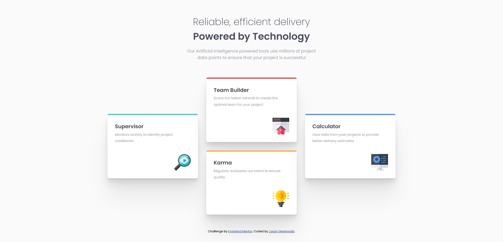

# Frontend Mentor - Four card feature section solution

This is a solution to the [Four card feature section challenge on Frontend Mentor](https://www.frontendmentor.io/challenges/four-card-feature-section-weK1eFYK). Frontend Mentor challenges help you improve your coding skills by building realistic projects. 

## Table of contents

- [Overview](#overview)
  - [The challenge](#the-challenge)
  - [Screenshot](#screenshot)
  - [Links](#links)
- [My process](#my-process)
  - [Built with](#built-with)
  - [What I learned](#what-i-learned)
  - [Continued development](#continued-development)
  - [Useful resources](#useful-resources)
- [Author](#author)
- [Acknowledgments](#acknowledgments)

## Overview

### The challenge

Users should be able to:

- View the optimal layout for the site depending on their device's screen size

### Screenshot



### Links

- Solution URL: [Add solution URL here](https://your-solution-url.com)
- Live Site URL: https://jaycgreenwald.github.io/four-card-feature-section/
- GitHub URL: https://github.com/jaycgreenwald/four-card-feature-section

## My process

### Built with

- Semantic HTML5 markup
- CSS custom properties
- Flexbox
- CSS Grid
- Mobile-first workflow

### What I learned

- How to use Grid! - This my first time using it.
- CSS Variables - I have only used variables once before so it was time to practice more.
- Max-width - Started using max-width which I didn't understand before.
- Linear Gradient - Used it for the first time and was suprised to learn I could create the feature card design with it.

```css
:root {
    --red: hsl(0, 78%, 62%);
    --cyan: hsl(180, 62%, 55%);
    --orange: hsl(34, 97%, 64%);
    --blue: hsl(212, 86%, 64%);
    --very-dark-blue: hsl(234, 12%, 34%);
    --grayish-blue: hsl(229, 6%, 66%);
    --very-light-gray: hsl(0, 0%, 98%);
}
```

```css
.card {
    max-width: 19.5rem;
    border-radius: .2rem;
    margin: auto;
    display: grid;
    grid-row-gap: 1.45rem;
}
```

```css
.card__feature-card--red {
    background: linear-gradient(to bottom, var(--red) 0 2%, hsl(0, 0%, 100%) 2% 100%);
}
```

### Continued development

I want to continue to work with Grid - maybe use grid-template-areas next time?
I want to keep working on making responsive pages.

### Useful resources

- [linear-gradient at MDN](https://developer.mozilla.org/en-US/docs/Web/CSS/gradient/linear-gradient) - I had no idea how to use linear-gradient so I started here.
- [Kevin Powell](https://www.kevinpowell.co/) - I watched a lot of KP videos during this. I picked up this resource from reading one of [Vikram Ingleshwar's](https://www.frontendmentor.io/profile/vikramvi) README docs.

## Author

- GitHub Profile - [jaycgreenwald](https://github.com/jaycgreenwald)
- Frontend Mentor - [@jaycgreenwald](https://www.frontendmentor.io/profile/jaycgreenwald)
- Twitter - [@jaycgreenwald](https://www.twitter.com/jaycgreenwald)

## Acknowledgments

I'd like to thank the Frontend Mentor Slack community!